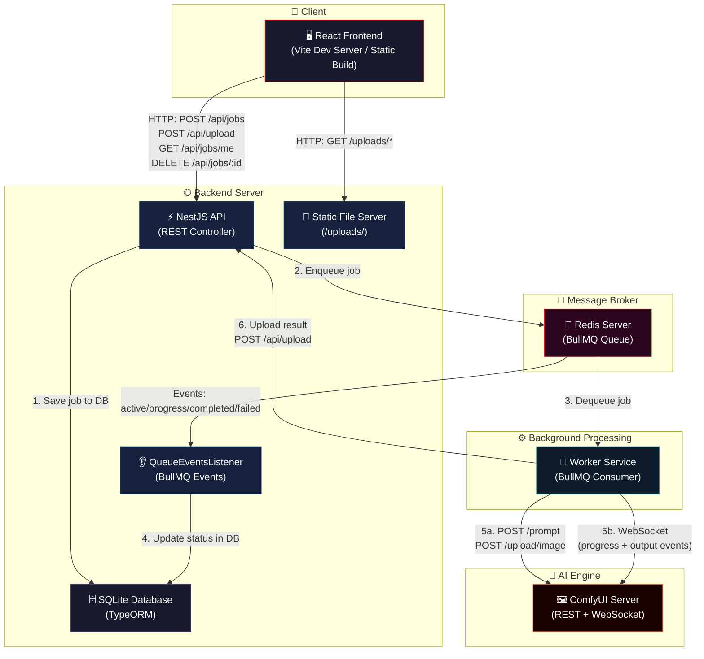
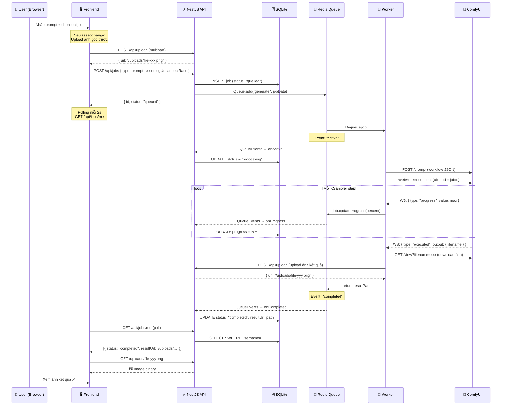

# 🏗️ Kiến Trúc Hệ Thống — Image Generation Demo

## Tổng Quan

Hệ thống gồm **3 module độc lập** giao tiếp bất đồng bộ qua **Redis (BullMQ)**, phục vụ mục đích sinh ảnh AI thông qua ComfyUI:

| Module | Công nghệ | Vai trò |
|--------|-----------|---------|
| **Frontend** | React + Vite + TailwindCSS + Zustand | Giao diện người dùng, submit job, theo dõi tiến trình |
| **Backend** | NestJS + TypeORM + SQLite + BullMQ | API gateway, quản lý jobs, phục vụ ảnh tĩnh |
| **Worker** | Node.js (TypeScript ESM) + BullMQ | Xử lý nền, giao tiếp ComfyUI, upload kết quả |

---

## Sơ Đồ Kiến Trúc Tổng Thể



---

## Luồng Xử Lý Chi Tiết (Data Flow)



---

## Cấu Trúc Thư Mục

```
create_image_demo/
├── 📁 frontend/                    ← React SPA (Vite)
│   ├── .env                        ← VITE_API_URL (git-ignored)
│   ├── vite.config.js              ← Proxy config (đọc từ .env)
│   └── src/
│       ├── data/api/               ← API layer (REST calls)
│       │   ├── jobs/real.js         ← Gọi thực tế tới Backend
│       │   └── jobs/mock.js         ← Mock data cho dev offline
│       ├── presentation/
│       │   ├── pages/              ← LoginPage, DashboardPage
│       │   ├── components/         ← atoms / molecules / organisms
│       │   └── store/              ← Zustand stores (auth, job, theme)
│       └── index.css               ← Design tokens + TailwindCSS
│
├── 📁 backend/                     ← NestJS API Server
│   ├── .env                        ← Redis credentials (git-ignored)
│   ├── ecosystem.config.js         ← PM2 deployment config
│   └── src/
│       ├── delivery/http/          ← Controllers (JobController, UploadController)
│       ├── application/            ← Services + QueueEventsListener
│       ├── domain/                 ← Entity definitions (Job)
│       ├── infrastructure/         ← Storage strategy (local disk)
│       └── main.ts                 ← Bootstrap + CORS config
│
├── 📁 worker/                      ← Background Job Processor
│   ├── .env                        ← Redis + ComfyUI + Backend URLs (git-ignored)
│   └── src/
│       ├── comfy/
│       │   ├── comfy-client.ts     ← REST client (upload/download/prompt)
│       │   ├── ws-listener.ts      ← WebSocket listener (progress/output)
│       │   └── workflows/          ← ComfyUI workflow JSONs (t2i, change_style)
│       ├── processor/
│       │   └── job-processor.ts    ← Core processing logic
│       ├── config/config.ts        ← Environment config loader
│       └── index.ts                ← BullMQ Worker entry point
│
├── .gitignore                      ← Ignore node_modules, dist, .env, uploads, sqlite
└── ecosystem.config.js             ← Root PM2 config (backend + worker)
```

---

## Các Pattern Kiến Trúc Được Áp Dụng

### 1. Message Queue Pattern (Producer → Broker → Consumer)
Backend đóng vai trò **Producer** — đẩy job vào Redis Queue.
Worker đóng vai trò **Consumer** — lấy job ra và xử lý bất đồng bộ.
Giao tiếp giữa hai bên hoàn toàn qua **BullMQ/Redis**, không có kết nối trực tiếp.

### 2. Event-Driven Architecture
`QueueEventsListener` trong Backend lắng nghe các sự kiện từ Redis (`active`, `progress`, `completed`, `failed`) để cập nhật Database theo thời gian thực, mà không cần Worker gọi ngược API.

### 3. Clean Architecture (Backend)
Backend được tổ chức theo các lớp tách biệt:
- **Delivery** (Controllers) → nhận HTTP request
- **Application** (Services) → business logic
- **Domain** (Entities) → data models
- **Infrastructure** (Storage) → triển khai cụ thể (local disk, S3,...)

### 4. Atomic Design (Frontend)
UI được chia thành các cấp:
- **Atoms** — Button, Card, Badge, Input
- **Molecules** — FormGroup, JobTracker
- **Organisms** — CreateJobForm, JobCard, Navbar
- **Pages** — LoginPage, DashboardPage

---

## Ưu Điểm

| # | Ưu điểm | Giải thích |
|---|---------|------------|
| 1 | **Tách biệt hoàn toàn 3 module** | Frontend, Backend, Worker có thể deploy trên các server khác nhau, scale độc lập |
| 2 | **Xử lý bất đồng bộ** | Job nặng (AI generation) chạy nền qua Worker, không block API server |
| 3 | **Theo dõi tiến trình real-time** | WebSocket từ ComfyUI → Worker → Redis Events → Backend → Database → Frontend (polling) |
| 4 | **Dễ thay thế AI engine** | Chỉ cần sửa workflow JSON và adapter trong Worker, không ảnh hưởng Frontend/Backend |
| 5 | **Strategy Pattern cho Storage** | Backend dùng interface `IStorageStrategy`, dễ chuyển từ local disk sang S3/GCS mà không đụng business logic |
| 6 | **Cấu hình linh hoạt** | Tất cả credentials và URLs nằm trong `.env`, git-ignored an toàn |
| 7 | **Horizontal scaling Worker** | Có thể chạy nhiều instance Worker cùng lúc (mỗi instance chạy trên 1 GPU khác nhau) để xử lý song song |
| 8 | **Frontend tách biệt Data layer** | Mock API và Real API cùng interface, dễ dev offline hoặc test |

---

## Nhược Điểm & Hạn Chế

| # | Nhược điểm | Giải thích |
|---|-----------|------------|
| 1 | **Polling thay vì Push** | Frontend dùng `setInterval` 2s để check trạng thái job thay vì dùng WebSocket/SSE trực tiếp tới client — gây delay nhỏ và tốn bandwidth |
| 2 | **SQLite không phù hợp production lớn** | SQLite chỉ hỗ trợ 1 writer tại 1 thời điểm, không scale được khi nhiều Backend instance cùng ghi — cần chuyển sang PostgreSQL/MySQL |
| 3 | **Chưa có Authentication thực sự** | Username truyền qua header `x-username` không có xác thực, ai cũng có thể giả mạo — cần thêm JWT hoặc session-based auth |
| 4 | **Single Point of Failure (Redis)** | Nếu Redis chết, toàn bộ hệ thống queue ngừng hoạt động — cần Redis Sentinel hoặc Cluster cho production |
| 5 | **File storage trên local disk** | Ảnh lưu trực tiếp trên ổ cứng server, không có CDN, backup, hay redundancy — cần chuyển sang S3/MinIO cho production |
| 6 | **Chưa có rate limiting** | Không giới hạn số lượng job submit/user — có thể bị spam hoặc abuse GPU resources |
| 7 | **Chưa có retry policy rõ ràng** | BullMQ có default retry nhưng chưa cấu hình chi tiết backoff/max attempts cho từng loại lỗi |
| 8 | **Eviction policy Redis chưa đúng** | Redis đang dùng `allkeys-lru` thay vì `noeviction` — có thể mất job data khi Redis đầy bộ nhớ |

---

## Tóm Tắt

Đây là kiến trúc **3-tier microservices đơn giản** sử dụng Message Queue làm backbone giao tiếp:

> **Frontend** ← HTTP → **Backend API** ← Redis/BullMQ → **Worker** ← REST+WS → **ComfyUI**

Kiến trúc này phù hợp cho **demo và MVP**, có thể nâng cấp lên production bằng cách:
1. Thay SQLite → PostgreSQL
2. Thay polling → WebSocket/SSE push tới client
3. Thêm JWT Authentication
4. Thay local storage → S3 + CDN
5. Cấu hình Redis Sentinel/Cluster
6. Thêm rate limiting và monitoring (Prometheus + Grafana)
